## 目录

* [C/C++](#cc)
* [STL](#stl)
* [数据结构](#%E6%95%B0%E6%8D%AE%E7%BB%93%E6%9E%84)
* [算法](#%E7%AE%97%E6%B3%95)
* [Problems](#problems)
* [操作系统](#%E6%93%8D%E4%BD%9C%E7%B3%BB%E7%BB%9F)
* [计算机网络](#%E8%AE%A1%E7%AE%97%E6%9C%BA%E7%BD%91%E7%BB%9C)
* [网络编程](#%E7%BD%91%E7%BB%9C%E7%BC%96%E7%A8%8B)
* [数据库](#%E6%95%B0%E6%8D%AE%E5%BA%93)
* [设计模式](#%E8%AE%BE%E8%AE%A1%E6%A8%A1%E5%BC%8F)
* [链接装载库](#%E9%93%BE%E6%8E%A5%E8%A3%85%E8%BD%BD%E5%BA%93)
* [海量数据处理](#%E6%B5%B7%E9%87%8F%E6%95%B0%E6%8D%AE%E5%A4%84%E7%90%86)
* [其他](#%E5%85%B6%E4%BB%96)
* [书籍](#%E4%B9%A6%E7%B1%8D)
* [复习刷题网站](#%E5%A4%8D%E4%B9%A0%E5%88%B7%E9%A2%98%E7%BD%91%E7%AB%99)
* [招聘时间岗位](#%E6%8B%9B%E8%81%98%E6%97%B6%E9%97%B4%E5%B2%97%E4%BD%8D)
* [面试题目经验](#%E9%9D%A2%E8%AF%95%E9%A2%98%E7%9B%AE%E7%BB%8F%E9%AA%8C)


## C/C++

### const

```cpp
// 类
class A
{
private:
    const int a;                // 常对象成员，只能在初始化列表赋值

public:
    // 构造函数
    A() { };
    A(int x) : a(x) { };        // 初始化列表

    // const可用于对重载函数的区分
    int getValue();             // 普通成员函数
    int getValue() const;       // 常成员函数，不得修改类中的任何数据成员的值
};

void function()
{
    // 对象
    A b;                        // 普通对象，可以调用全部成员函数
    const A a;                  // 常对象，只能调用常成员函数、更新常成员变量
    canst A *p = &a;            // 常指针
    canst A &q = a;             // 常引用

    // 指针
    char greeting[] = "Hello";
    char* p1 = greeting;                // 指针变量，指向字符数组变量
    const char* p2 = greeting;          // 指针变量，指向字符数组常量
    char* const p3 = greeting;          // 常指针，指向字符数组变量
    const char* const p4 = greeting;    // 常指针，指向字符数组常量
}

// 函数
void function1(const int Var);           // 传递过来的参数在函数内不可变
void function2(const char* Var);         // 参数指针所指内容为常量
void function3(char* const Var);         // 参数指针为常指针
void function4(const int& Var);          // 引用参数在函数内为常量

// 函数返回值
const int function5();      // 返回一个常数
const int* function6();     // 返回一个指向常量的指针变量，使用：const int *p = function6();
int* const function7();     // 返回一个指向变量的常指针，使用：int* const p = function7();
```

#### 作用

1. 修饰变量，说明该变量不可以被改变；
2. 修饰指针，分为指向常量的指针和指针常量；
3. 常量引用，经常用于形参类型，即避免了拷贝，又避免了函数对值的修改；
4. 修饰成员函数，说明该成员函数内不能修改成员变量。

### static

#### 作用

1. 修饰普通变量，修改变量的存储区域和生命周期，使变量存储在静态区，在main函数运行前就分配了空间，如果有初始值就用初始值初始化它，如果没有初始值系统用默认值初始化它。
2. 修饰普通函数，表明函数的作用范围，仅在定义该函数的文件内才能使用。在多人开发项目时，为了防止与他人命令函数重名，可以将函数定位为static。
3. 修饰成员变量，修饰成员变量使所有的对象只保存一个该变量，而且不需要生成对象就可以访问该成员。
4. 修饰成员函数，修饰成员函数使得不需要生成对象就可以访问该函数，但是在static函数内不能访问非静态成员。

### this 指针

1. `this` 指针是一个隐含于每一个成员函数中的特殊指针。它指向正在被该成员函数操作的那个对象。
2. 当对一个对象调用成员函数时，编译程序先将对象的地址赋给 `this` 指针，然后调用成员函数，每次成员函数存取数据成员时，由隐含使用 `this` 指针。
3. 当一个成员函数被调用时，自动向它传递一个隐含的参数，该参数是一个指向这个成员函数所在的对象的指针。
4. `this` 指针被隐含地声明为: `ClassName *const this`，这意味着不能给 `this` 指针赋值；在 `ClassName` 类的 `const` 成员函数中，`this` 指针的类型为：`const ClassName* const`，这说明不能对 `this` 指针所指向的这种对象是不可修改的（即不能对这种对象的数据成员进行赋值操作）；
5. 由于 `this` 并不是一个常规变量，所以，不能取得 `this` 的地址。
6. 在以下场景中，经常需要显式引用 `this` 指针：
        1. 为实现对象的链式引用；
        2. 为避免对同一对象进行赋值操作；
        3. 在实现一些数据结构时，如 `list`。

### inline 内联函数

#### 特征

* 相当于把内联函数里面的内容写在调用内联函数处；
* 相当于不用执行进入函数的步骤，直接执行函数体；
* 相当于宏，却比宏多了类型检查，真正具有函数特性；
* 不能包含循环、递归、switch等复杂操作。

#### 使用

```cpp
// 声明1（加inline，建议使用）
inline int functionName(int first, int secend,...);

// 声明2（不加inline）
int functionName(int first, int secend,...);

// 定义
inline int functionName(int first, int secend,...) {/****/};
```

#### 编译器对inline函数的处理步骤

1. 将inline函数体复制到inline函数调用点处； 
2. 为所用inline函数中的局部变量分配内存空间； 
3. 将inline函数的的输入参数和返回值映射到调用方法的局部变量空间中； 
4. 如果inline函数有多个返回点，将其转变为inline函数代码块末尾的分支（使用GOTO）。

#### 优缺点

优点

1. 内联函数同宏函数一样将在被调用处进行代码展开，省去了参数压栈、栈帧开辟与回收，结果返回等，从而提高程序运行速度。
2. 内联函数相比宏函数来说，在代码展开时，会做安全检查或自动类型转换（同普通函数），而宏定义则不会。 
3. 在类中声明同时定义的成员函数，自动转化为内联函数，因此内联函数可以访问类的成员变量，宏定义则不能。
4. 内联函数在运行时可调试，而宏定义不可以。

缺点

1. 代码膨胀。内联是以代码膨胀（复制）为代价，消除函数调用带来的开销。如果执行函数体内代码的时间，相比于函数调用的开销较大，那么效率的收获会很少。另一方面，每一处内联函数的调用都要复制代码，将使程序的总代码量增大，消耗更多的内存空间。
2. inline函数无法随着函数库升级而升级。inline函数的改变需要重新编译，不像non-inline可以直接链接。
3. 是否内联，程序员不可控。内联函数只是对编译器的建议，是否对函数内联，决定权在于编译器。

### assert()

断言，是宏，而非函数。assert宏的原型定义在`<assert.h>`中，其作用是如果它的条件返回错误，则终止程序执行。

如

```cpp
assert( p != NULL );
```

### sizeof()

* sizeof对数组，得到整个数组所占空间大小。
* sizeof对指针，得到指针本身所占空间大小。

### #pragma pack(n)

设定结构体、联合以及类成员变量以n字节方式对齐

如

```cpp
#pragma pack(push)  //保存对齐状态
#pragma pack(4)     //设定为4字节对齐

struct test
{
    char m1;
    double m4;
    int m3;
};

#pragma pack(pop)   //恢复对齐状态
```

### extern "C"

* 被extern限定的函数或变量是extern类型的
* 被extern "C"修饰的变量和函数是按照C语言方式编译和连接的

extern "C" 的作用是让C++编译器将 `extern "C"` 声明的代码当作C语言代码处理，可以避免C++因符号修饰导致代码不能和C语言库中的符号进行链接的问题。

```cpp
#ifdef __cplusplus
extern "C" {
#endif

void *memset(void *, int, size_t);

#ifdef __cplusplus
}
#endif
```

### struct 和 typedef struct

#### C 中

```c
// c
typedef struct Student {
    int age; 
} S;
```

等价于

```c
// c
struct Student { 
    int age; 
};

typedef struct Student S;
```

此时 `S` 等价于 `struct Student`，但两个标识符名称空间不相同。

另外还可以定义与 `struct Student` 不冲突的 `void Student() {}`。

#### C++ 中

由于编译器定位符号的规则（搜索规则）改变，导致不同于C语言。

一、如果在类标识符空间定义了 `struct Student {...};`，使用 `Student me;` 时，编译器将搜索全局标识符表，`Student` 未找到，则在类标识符内搜索。

即表现为可以使用 `Student` 也可以使用 `struct Student`，如下：

```cpp
// cpp
struct Student { 
    int age; 
};

void f( Student me );       // 正确，"struct" 关键字可省略
```

二、若定义了与 `Student` 同名函数之后，则 `Student` 只代表函数，不代表结构体，如下：

```cpp
typedef struct Student { 
    int age; 
} S;

void Student() {}           // 正确，定义后 "Student" 只代表此函数

//void S() {}               // 错误，符号 "S" 已经被定义为一个 "struct Student" 的别名

int main() {
    Student(); 
    struct Student me;      // 或者 "S me";
    return 0;
}
```

### C++ 中 struct 和 class

总的来说，struct更适合看成是一个数据结构的实现体，class更适合看成是一个对象的实现体。

#### 区别

* 最本质的一个区别就是默认的访问控制
    1. 默认的继承访问权限。struct是public的，class是private的。  
    2. struct作为数据结构的实现体，它默认的数据访问控制是public的，而class作为对象的实现体，它默认的成员变量访问控制是private的。

### explicit （显式）构造函数

explicit修饰的构造函数可用来防止隐式转换

如下

```cpp
class Test1
{
public:
    Test1(int n)            //普通构造函数
    {
        num=n;
    }
private:
    int num;
};

class Test2
{
public:
    explicit Test2(int n)   //explicit(显式)构造函数
    {
        num=n;
    }
private:
    int num;
};

int main()
{
    Test1 t1=12;            //隐式调用其构造函数,成功
    Test2 t2=12;            //编译错误,不能隐式调用其构造函数
    Test2 t2(12);           //显式调用成功
    return 0;
}
```

### frend 友元类和友元函数

* 能访问私有成员  
* 破坏封装性
* 友元关系不可传递
* 友元关系的单向性
* 友元声明的形式及数量不受限制

### using 引入命名空间成员

```cpp
using namespace_name::name
```

#### 尽量不要使用`using namespace std;`污染命名空间

> 一般说来，使用using命令比使用using编译命令更安全，这是由于它**只导入了制定的名称**。如果该名称与局部名称发生冲突，编译器将**发出指示**。using编译命令导入所有的名称，包括可能并不需要的名称。如果与局部名称发生冲突，则**局部名称将覆盖名称空间版本**，而编译器**并不会发出警告**。另外，名称空间的开放性意味着名称空间的名称可能分散在多个地方，这使得难以准确知道添加了哪些名称。

尽量不要使用

```cpp
using namespace std;
```

应该使用

```cpp
int x;
std::cin >> x ;
std::cout << x << std::endl;
```

或者

```cpp
using std::cin;
using std::cout;
using std::endl;
int x;
cin >> x;
cout << x << endl;
```

### :: 范围解析运算符

`::` 可以加在类型名称（类、类成员、成员函数、变量等）前，表示作用域为全局命名空间

如

```cpp
int count = 0;      // global count

int main() {
  int count = 0;    // local count
  ::count = 1;      // set global count to 1
  count = 2;        // set local count to 2
  return 0;
}
```

### 宏

* 宏定义可以实现类似于函数的功能，但是它终归不是函数，而宏定义中括弧中的“参数”也不是真的参数，在宏展开的时候对“参数”进行的是一对一的替换。 

### 初始化列表

好处

* 更高效：少了一次调用默认构造函数的过程。
* 有些场合必须要用初始化列表：
  1. 常量成员，因为常量只能初始化不能赋值，所以必须放在初始化列表里面
  2. 引用类型，引用必须在定义的时候初始化，并且不能重新赋值，所以也要写在初始化列表里面
  3. 没有默认构造函数的类类型，因为使用初始化列表可以不必调用默认构造函数来初始化，而是直接调用拷贝构造函数初始化。


### 面向对象

面向对象程序设计（Object-oriented programming，OOP）是种具有对象概念的程序编程典范，同时也是一种程序开发的抽象方针。


面向对象三大特征 —— 封装、继承、多态

### 封装

* 把客观事物封装成抽象的类，并且类可以把自己的数据和方法只让可信的类或者对象操作，对不可信的进行信息隐藏。
* 关键字：public, protected, friendly, private。不写默认为 friendly。

| 关键字 | 当前类 | 包内 | 子孙类 | 包外 |
| --- | --- | --- | --- | --- |
| public | √ | √ | √ | √ |
| protected | √ | √ | √ | × |
| friendly | √ | √ | × | × |
| private | √ | × | × | × |

### 继承

* 基类（子类）——&gt; 派生类（父类）

### 多态

* 多态，即多种状态，在面向对象语言中，接口的多种不同的实现方式即为多态。多态性在C++中是通过虚函数来实现的。
* 多态是以封装和继承为基础的。

#### 静态多态（早绑定）

```cpp
class A
{
public:
    void do(int a);
    void do(int a, int b);
}
```

#### 动态多态（晚绑定）

* 用 virtual 修饰成员函数，使其成为虚函数

**注意：**

* 普通函数不能是虚函数
* 静态函数不能是虚函数
* 内联函数不能是虚函数
* 构造函数不能是虚函数  

```cpp
class Shape     //形状类
{
public:
    virtual double calcArea()
    {
        ...
    }
}
class Circle : public Shape     //圆形类
{
public:
    virtual double calcArea();
    ...
}
class Rect : public Shape       //矩形类
{
public:
    virtual double calcArea();
    ...
}
int main()
{
    Shape * shape1 = new Circle(4.0);
    Shape * shape2 = new Rect(5.0, 6.0);
    shape1->calcArea();         //调用圆形类里面的方法
    shape2->calcArea();         //调用矩形类里面的方法
    return 0；
}
```

* 虚析构函数

```cpp
class Shape
{
public:
    Shape();                //构造函数不能是虚函数
    virtual double calcArea();
    virtual ~Shape();       //虚析构函数
}
class Circle : public Shape //圆形类
{
public:
    virtual double calcArea();
    ...
}
int main()
{
    Shape * shape1 = new Circle(4.0);
    shape1->calcArea();    
    delete shape1;          //因为是虚析构函数，所以调用子类析构函数后，也调用父类析构函数。
    shape1 = NULL;
    return 0；
}
```

* 纯虚函数 （含有纯虚函数的类叫做抽象类）

```cpp
virtual int A() = 0;
```

### 抽象类、接口类、聚合类

* 抽象类：含有纯虚函数的类
* 接口类：仅含有纯虚函数的抽象类
* 聚合类：用户可以直接访问其成员，并且具有特殊的初始化语法形式。满足如下特点：
    * 所有成员都是public
    * 没有有定于任何构造函数
    * 没有类内初始化
    * 没有基类，也没有virtual函数
    * 如：
        ```cpp
        //定义：
        struct Date 
        {
            int ival;
            string s;
        }
        //初始化：
        Data vall = { 0, "Anna" };
        ```

### 内存分配和管理

#### malloc、calloc、realloc、alloca

1. malloc：申请指定字节数的内存。申请到的内存中的初始值不确定。
2. calloc：为指定长度的对象，分配能容纳其指定个数的内存。申请到的内存的每一位(bit)都初始化为0
3. realloc：更改以前分配的内存长度(增加或减少)。当增加长度时，可能需将以前分配区的内容移到另一个足够大的区域，而新增区域内的初始值则不确定
4. alloca：在栈上申请内存。程序在出栈的时候，会自动释放内存。但是需要注意的是，alloca不具可移植性, 而且在没有传统堆栈的机器上很难实现。alloca不宜使用在必须广泛移植的程序中,。C99中支持变长数组(VLA), 可以用来替代alloca()。

#### malloc、free

申请内存，确认是否申请成功

```cpp
char *str = (char*) malloc(100);
assert(str != nullptr);
```

释放内存后指针置空

```cpp
free(p); 
p = nullptr;
```

#### new、delete

1. new/new[]：完成两件事，先底层调用malloc分了配内存，然后创建一个对象（调用构造函数）。
2. delete/delete[]：也完成两件事，先调用析构函数（清理资源），然后底层调用free释放空间。
3. new在申请内存时会自动计算所需字节数，而malloc则需我们自己输入申请内存空间的字节数。

```cpp
int main()
{
    T* t = new T();     // 先内存分配 ，再构造函数
    delete t;           // 先析构函数，再内存释放
    return 0;
}
```

### 智能指针

#### C++标准库（STL）中

头文件：`#include <memory>`

##### C++98

```cpp
std::auto_ptr<std::string> ps (new std::string(str))；
```

##### C++11

1. shared_ptr
2. unique_ptr
3. weak_ptr
4. auto_ptr


### 运行时类型识别（RTTI）

```cpp
class Flyable                       //【能飞的】
{
public:
    virtual void takeoff() = 0;     // 起飞
    virtual void land() = 0;        // 降落
}
class Bird : public Flyable         //【鸟】
{
public:
    void foraging() {...}           // 觅食
    virtual void takeoff() {...}
    virtual void land() {...}
}
class Plane : public Flyable        //【飞机】
{
public:
    void carry() {...}              // 运输
    virtual void take off() {...}
    virtual void land() {...}
}

class type_info
{
public:
    const char* name() const;
    bool operator == (const type_info & rhs) const;
    bool operator != (const type_info & rhs) const;
    int before(const type_info & rhs) const;
    virtual ~type_info();
private:
    ...
}

class doSomething(Flyable *obj)                 //【做些事情】
{
    obj->takeoff();

    cout << typeid(*obj).name() << endl;        //输出传入对象类型（Bird or Plane）

    if(typeid(*obj) == typeid(Bird))            //判断对象类型
    {
        Bird *bird = dynamic_cast<Bird *>(obj); //对象转化
        bird->foraging();
    }

    obj->land();
}
```

dynamic\_cast 注意事项：
* 只能应用于指针和引用的转化
* 要转化的类型中必须包含虚函数
* 转化成功返回子类的地址，转化失败返回NULL

typeid 注意事项：
* type\_id 返回一个 type\_info 对象的引用
* 如果想通过基类的指针获得派生类的数据类型，基类必须带有虚函数
* 只能获取对象的实际类型

### Effective C++

1. 视C++为一个语言联邦（C、Object-Oriented C++、Template C++、STL）
2. 尽量以`const`、`enum`、`inline`替换`#define`（宁可以编译器替换预处理器）
3. 尽可能使用const
4. 确定对象被使用前已先被初始化
5. 了解C++默默编写并调用哪些函数（编译器暗自为class创建default构造函数、copy构造函数、copy assignment操作符、析构函数）


### Google C++ Style Guide


> 图片来源于：[CSDN . 一张图总结Google C++编程规范(Google C++ Style Guide)](http://blog.csdn.net/voidccc/article/details/37599203)

## STL

### 容器底层数据结构实现

* vector：底层数据结构为数组，支持快速随机访问
* list：底层数据结构为双向链表，支持快速增删
* deque：底层数据结构为一个中央控制器和多个缓冲区，支持首尾（中间不能）快速增删，也支持随机访问
    * deque是一个双端队列(double-ended queue)，也是在堆中保存内容的.它的保存形式如下:
    * [堆1] --> [堆2] -->[堆3] --> ...
    * 每个堆保存好几个元素,然后堆和堆之间有指针指向,看起来像是list和vector的结合品.
* stack：底层一般用list或deque实现，封闭头部即可，不用vector的原因应该是容量大小有限制，扩容耗时
* queue：底层一般用list或deque实现，封闭头部即可，不用vector的原因应该是容量大小有限制，扩容耗时
    * （stack和queue其实是适配器,而不叫容器，因为是对容器的再封装）
* priority_queue：底层数据结构一般为vector为底层容器，堆heap为处理规则来管理底层容器实现
* set：底层数据结构为红黑树，有序，不重复
* multiset：底层数据结构为红黑树，有序，可重复
* map：底层数据结构为红黑树，有序，不重复
* multimap：底层数据结构为红黑树，有序，可重复
* hash_set：底层数据结构为hash表，无序，不重复
* hash_multiset：底层数据结构为hash表，无序，可重复 
* hash_map：底层数据结构为hash表，无序，不重复
* hash_multimap：底层数据结构为hash表，无序，可重复 


## 数据结构

### 顺序结构

#### 顺序栈（Sequence Stack）

[SqStack.cpp](DataStructure/SqStack.cpp)

```cpp
typedef struct {
	ElemType *elem;
	int top;
	int size;
	int increment;
} SqSrack;
```

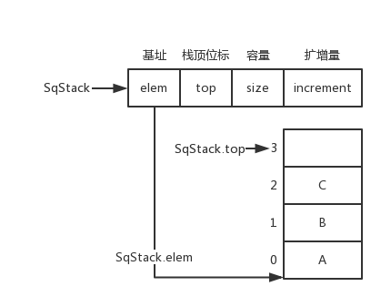

#### 队列（Sequence Queue）

```cpp
typedef struct {
	ElemType * elem;
	int front;
	int rear;
	int maxSize;
}SqQueue;
```

##### 非循环队列

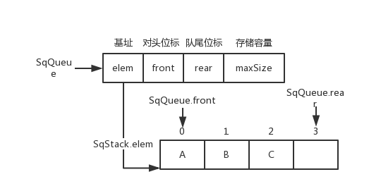

`SqQueue.rear++`

##### 循环队列

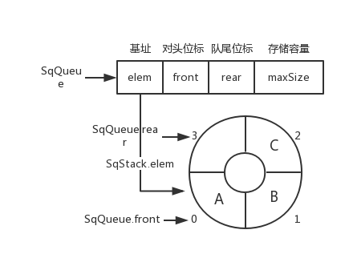

`SqQueue.rear = (SqQueue.rear + 1) % SqQueue.maxSize`

#### 顺序表（Sequence List）

[SqList.cpp](DataStructure/SqList.cpp)

```cpp
typedef struct {
	ElemType *elem;
	int length;
	int size;
	int increment;
} SqList;
```

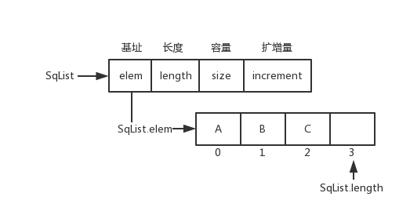

### 链式结构

[LinkList.cpp](DataStructure/LinkList.cpp)

[LinkList_with_head.cpp](DataStructure/LinkList_with_head.cpp)

```cpp
typedef struct LNode {
    ElemType data;
    struct LNode *next;
} LNode, *LinkList; 
```

#### 链队列（Link Queue）

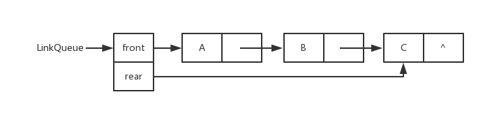

#### 线性表的链式表示

##### 单链表（Link List）

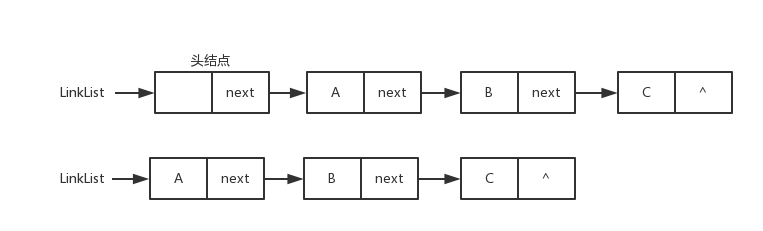

##### 双向链表（Du-Link-List）

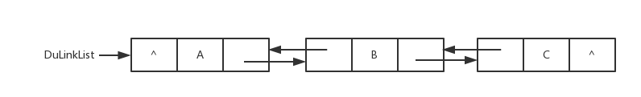

##### 循环链表（Cir-Link-List）

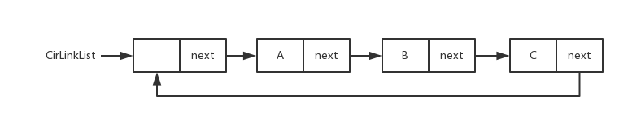

### 哈希表

[HashTable.cpp](DataStructure/HashTable.cpp)

#### 概念

哈希函数：`H(key): K -> D , key ∈ K`

#### 构造方法

* 直接定址法
* 除留余数法
* 数字分析法
* 折叠法
* 平方取中法

#### 冲突处理方法

* 链地址法：key相同的用单链表链接
* 开放定址法
    * 线性探测法：key相同 -> 放到key的下一个位置，`Hi = (H(key) + i) % m`
    * 二次探测法：key相同 -> 放到 `Di = 1^2, -1^2, ..., ±（k)^2,(k<=m/2）`
    * 随机探测法：`H = (H(key) + 伪随机数) % m`

#### 线性探测的哈希表数据结构

```cpp

typedef char KeyType;

typedef struct {
	KeyType key;
}RcdType;

typedef struct {
	RcdType *rcd;
	int size;
	int count;
	bool *tag;
}HashTable;
```
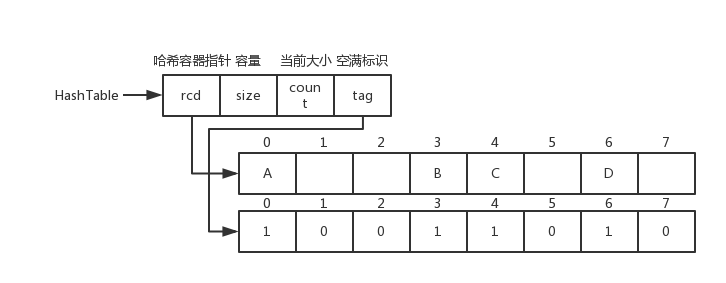

### 递归

#### 概念

函数直接或间接地调用自身

#### 递归与分治

* 分治法
    * 问题的分解
    * 问题规模的分解
* 折半查找（递归）
* 归并查找（递归）
* 快速排序（递归）

#### 递归与迭代

* 迭代：反复利用变量旧值推出新值
* 折半查找（迭代）
* 归并查找（迭代）

#### 广义表

##### 头尾链表存储表示

```cpp
// 广义表的头尾链表存储表示
typedef enum {ATOM, LIST} ElemTag;
// ATOM==0：原子，LIST==1：子表
typedef struct GLNode {
    ElemTag tag;
    // 公共部分，用于区分原子结点和表结点
    union {
        // 原子结点和表结点的联合部分
        AtomType atom;
        // atom是原子结点的值域，AtomType由用户定义
        struct {
            struct GLNode *hp, *tp;
        } ptr;
        // ptr是表结点的指针域，prt.hp和ptr.tp分别指向表头和表尾
    } a;
} *GList, GLNode;
```

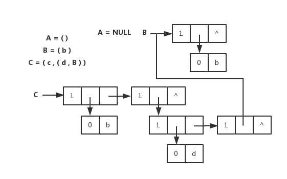

##### 扩展线性链表存储表示

```cpp
// 广义表的扩展线性链表存储表示
typedef enum {ATOM, LIST} ElemTag;
// ATOM==0：原子，LIST==1：子表
typedef struct GLNode1 {
    ElemTag tag;
    // 公共部分，用于区分原子结点和表结点
    union {
        // 原子结点和表结点的联合部分
        AtomType atom; // 原子结点的值域
        struct GLNode1 *hp; // 表结点的表头指针
    } a;
    struct GLNode1 *tp;
    // 相当于线性链表的next，指向下一个元素结点
} *GList1, GLNode1;
```

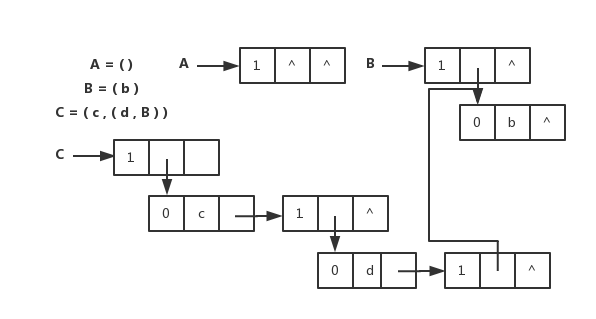

### 二叉树

[BinaryTree.cpp](DataStructure/BinaryTree.cpp)

#### 性质

1. 非空二叉树第 i 层最多 2^(i-1) 个结点 (i >= 1)
2. 深度为 k 的二叉树最多 2^k - 1 个结点 (k >= 1)
3. 度为 0 的结点数为 n0，度为 2 的结点数为 n2，则 n0 = n2 + 1
4. 有 n 个结点的完全二叉树深度 k = ⌊ log2(n) ⌋ + 1 
5. 对于含 n 个结点的完全二叉树中编号为 i (1 <= i <= n) 的结点
    1. 若 i = 1，为根，否则双亲为 ⌊ i / 2 ⌋
    2. 若 2i > n，则 i 结点没有左孩子，否则孩子编号为 2i + 1
    3. 若 2i + 1 > n，则 i 结点没有右孩子，否则孩子编号为 2i + 1

#### 存储结构

```cpp
typedef struct BiTNode
{
    TElemType data;
    struct BiTNode *lchild, *rchild;
}BiTNode, *BiTree;
```

##### 顺序存储

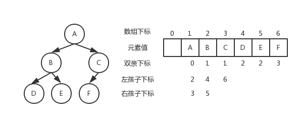

##### 链式存储

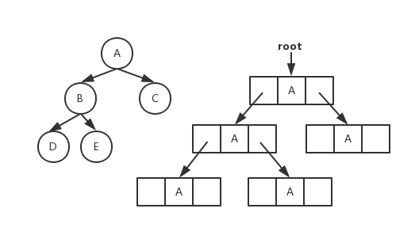

#### 遍历方式

* 先序遍历
* 中序遍历
* 后续遍历
* 层次遍历

#### 分类

* 满二叉树
* 完全二叉树（堆）
    * 大顶堆：根 >= 左 && 根 >= 右
    * 小顶堆：根 <= 左 && 根 <= 右
* 二叉查找树（二叉排序树）：左 < 根 < 右
* 平衡二叉树（AVL树）：| 左子树树高 - 右子树树高 | <= 1
* 最小失衡树：平衡二叉树插入新结点导致失衡的子树：调整：
    * LL型：根的左孩子右旋
    * RR型：根的右孩子左旋
    * LR型：根的左孩子左旋，再右旋
    * RL型：右孩子的左子树，先右旋，再左旋

### 其他树及森林

#### 树的存储结构

* 双亲表示法
* 双亲孩子表示法
* 孩子兄弟表示法

#### 并查集

一种不相交的子集所构成的集合 S = {S1, S2, ..., Sn}

#### 平衡二叉树（AVL树）

##### 性质

* | 左子树树高 - 右子树树高 | <= 1
* 平衡二叉树必定是二叉搜索树，反之则不一定
* 最小二叉平衡树的节点的公式：`F(n)=F(n-1)+F(n-2)+1` （1是根节点，F(n-1)是左子树的节点数量，F(n-2)是右子树的节点数量）

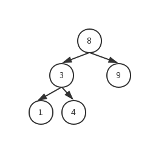

##### 最小失衡树

平衡二叉树插入新结点导致失衡的子树

调整：

* LL型：根的左孩子右旋
* RR型：根的右孩子左旋
* LR型：根的左孩子左旋，再右旋
* RL型：右孩子的左子树，先右旋，再左旋

#### 红黑树

##### 应用

* 关联数组：如STL中的map、set

#### B树

#### B+树

#### 八叉树

### 图

## 算法

### 排序

* [冒泡排序](Algorithm/BubbleSort.h)
* [冒泡排序（改进版）](Algorithm/BubbleSort_orderly.h)
* [选择排序](Algorithm/SelectionSort.h)
* [快速排序](Algorithm/QuickSort.h)
* [文件排序](Algorithm/FileSort)

### 查找

* [顺序查找](Algorithm/SequentialSearch.h)
* [蛮力字符串匹配](Algorithm/BruteForceStringMatch.h)
* [文件查找](Algorithm/FileSearch)

## Problems

### Single Problem

* [Chessboard Coverage Problem (棋盘覆盖问题)](Problems/ChessboardCoverageProblem)
* [Knapsack Problem (背包问题)](Problems/KnapsackProblem)
* [Neumann Neighbor Problem (冯诺依曼邻居问题)](Problems/NeumannNeighborProblem)
* [Round Robin Problem (循环赛日程安排问题)](Problems/RoundRobinProblem)
* [Tubing Problem (输油管道问题)](Problems/TubingProblem)

### Leetcode Problems

#### Array

* [1. Two Sum](Problems/LeetcodeProblems/1-two-sum.h)
* [4. Median of Two Sorted Arrays](Problems/LeetcodeProblems/4-median-of-two-sorted-arrays.h)
* [11. Container With Most Water](Problems/LeetcodeProblems/11-container-with-most-water.h)
* [26. Remove Duplicates from Sorted Array](Problems/LeetcodeProblems/26-remove-duplicates-from-sorted-array.h)
* [53. Maximum Subarray](Problems/LeetcodeProblems/53-maximum-subarray.h)
* [66. Plus One](Problems/LeetcodeProblems/66-plus-one.h)
* [88. Merge Sorted Array](Problems/LeetcodeProblems/88-merge-sorted-array.h)
* [118. Pascal's Triangle](Problems/LeetcodeProblems/118-pascals-triangle.h)
* [119. Pascal's Triangle II](Problems/LeetcodeProblems/119-pascals-triangle-ii.h)
* [121. Best Time to Buy and Sell Stock](Problems/LeetcodeProblems/121-best-time-to-buy-and-sell-stock.h)
* [122. Best Time to Buy and Sell Stock II](Problems/LeetcodeProblems/122-best-time-to-buy-and-sell-stock-ii.h)
* [169. Majority Element](Problems/LeetcodeProblems/169-majority-element.h)
* [283. Move Zeroes](Problems/LeetcodeProblems/283-move-zeroes.h)


## 操作系统

* 进程间的通信方式（管道、有名管道、信号、共享内存、消息队列、信号量、套接字、文件）
* 线程和进程的差异

## 计算机网络

计算机经网络体系结构：


### 物理层

* 传输数据的单位 ———— 比特
* 数据传输系统：源系统（源点、发送器） --> 传输系统 --> 目的系统（接收器、终点）

通道：
* 单向通道（单工通道）：只有一个方向通信，没有反方向交互，如广播
* 双向交替通行（半双工通信）：通信双方都可发消息，但不能同时发送或接收
* 双向同时通信（全双工通信）：通信双方可以同时发送和接收信息

通道复用技术：
* 频分复用（FDM，Frequency Division Multiplexing）：不同用户在不同频带，所用用户在同样时间占用不同带宽资源
* 时分复用（TDM，Time Division Multiplexing）：不同用户在同一时间段的不同时间片，所有用户在不同时间占用同样的频带宽度
* 波分复用（WDM，Wavelength Division Multiplexing）：光的频分复用
* 码分复用（CDM，Code Division Multiplexing）：不同用户使用不同的码，可以在同样时间使用同样频带通信

### 数据链路层

主要信道：
* 点对点信道
* 广播信道

#### 点对点信道

* 数据单元 ———— 帧

三个基本问题：
* 封装成帧：把网络层的IP数据报封装成帧，`SOH - 数据部分 - EOT`
* 透明传输：不管数据部分什么字符，都能传输出去；可以通过字节填充方法解决（冲突字符前加转义字符）
* 差错检测：降低误码率（BER，Bit Error Rate），广泛使用循环冗余检测（CRC，Cyclic Redundancy Check）

点对点协议（Point-to-Point Protocol）：
* 点对点协议（Point-to-Point Protocol）：用户计算机和ISP通信时所使用的协议

#### 广播信道

广播通信：
* 硬件地址（物理地址、MAC地址）
* 单播（unicast）帧（一对一）：收到的帧的MAC地址与本站的硬件地址相同
* 广播（broadcast）帧（一对全体）：发送给本局域网上所有站点的帧
* 多播（multicast）帧（一对多）：发送给本局域网上一部分站点的帧

### 网络层

* IP（Internet Protocol，网际协议）是为计算机网络相互连接进行通信而设计的协议。
* ARP（Address Resolution Protocol，地址解析协议）
* ICMP（Internet Control Message Protocol，网际控制报文协议）
* IGMP（Internet Group Management Protocol，网际组管理协议）

#### IP 网际协议

IP地址分类：
* IP地址 ::= {<网络号>,<主机号>}


IP地址类别 | 网络号 | 网络范围 | 主机号 | IP地址范围
---|---|---|---|---
A 类 | 8bit，第一位固定为 0 | 0 —— 127 | 24bit | 1.0.0.0 —— 127.255.255.255
B 类 | 16bit，前两位固定为  10 | 128.0 —— 191.255 | 16bit | 128.0.0.0 —— 191.255.255.255
C  类 | 24bit，前三位固定为  110 | 192.0.0 —— 223.255.255 | 8bit | 192.0.0.0 —— 223.255.255.255
D  类 | 前四位固定为 1110，后面为多播地址
E  类 | 前五位固定为 11110，后面保留为今后所用

IP 数据报格式：

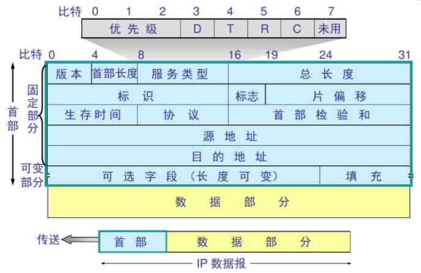

#### ICMP 网际控制报文协议

ICMP 报文格式：


应用：
* PING（Packet InterNet Groper，分组网间探测）测试两个主机之间的连通性
    * TTL（Time To Live，生存时间）该字段指定IP包被路由器丢弃之前允许通过的最大网段数量

#### 内部网关协议

* RIP（Routing Information Protocol，路由信息协议）
* OSPF（Open Sortest Path First，开放最短路径优先）

#### 外部网关协议

* BGP（Border Gateway Protocol，边界网关协议）

#### IP多播

* IGMP（Internet Group Management Protocol，网际组管理协议）
* 多播路由选择协议

#### VPN 和 NAT

* VPN（Virtual Private Network，虚拟专用网）
* NAT（Network Address Translation，网络地址转换）

### 运输层

协议：

* TCP（Transmission Control Protocol，传输控制协议）
* UDP（User Datagram Protocol，用户数据报协议）

端口：

应用程序 | FTP | TELNET | SMTP | DNS | TFTP | HTTP | HTTPS | SNMP
---| --- | --- |--- |--- |--- |--- |--- |--- |--- |--- |---  
端口号| 21 | 23 | 25 | 53 | 69 | 80 | 443 | 161

#### TCP

* TCP（Transmission Control Protocol，传输控制协议）是一种面向连接的、可靠的、基于字节流的传输层通信协议，其传输的单位是报文段。

特征：
* 面向连接
* 只能点对点（一对一）通信
* 可靠交互
* 全双工通信
* 面向字节流

特殊功能：
* 超时重传
* 流量控制
* 拥塞控制

TCP 报文结构

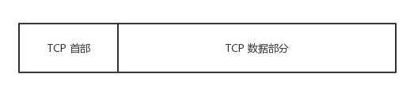

TCP 首部

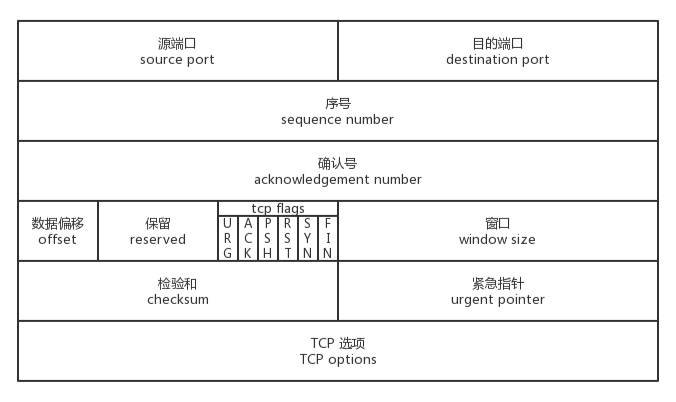

#### UDP

* UDP（User Datagram Protocol，用户数据报协议）是OSI（Open System Interconnection 开放式系统互联） 参考模型中一种无连接的传输层协议，提供面向事务的简单不可靠信息传送服务，其传输的单位是用户数据报。

特征：
* 无连接
* 尽最大努力交付
* 面向报文
* 没有拥塞控制
* 支持一对一、一对多、多对一、多对多的交互通信
* 首部开销小

UDP 报文结构

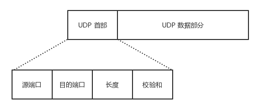

UDP 首部

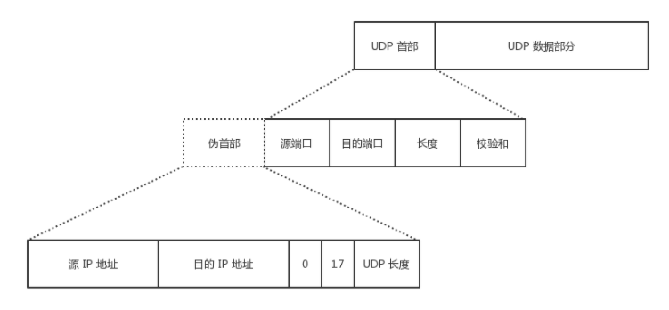

> TCP/UDP 图片来源于：<https://github.com/JerryC8080/understand-tcp-udp>

#### TCP传输连接管理

##### TCP 三次握手建立连接

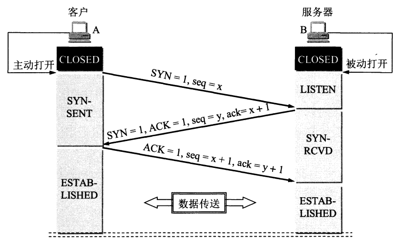

##### TCP 四次握手释放连接


### 应用层

* HTTP（HyperText Transfer Protocol，超文本传输协议）是用于从WWW（World Wide Web，万维网）服务器传输超文本到本地浏览器的传送协议。
* FTP（File Transfer Protocol，文件传输协议）用于Internet上的控制文件的双向传输。同时，它也是一个应用程序（Application）。
* SMTP（Simple Mail Transfer Protocol，简单邮件传输协议）是一组用于由源地址到目的地址传送邮件的规则，由它来控制信件的中转方式。SMTP协议属于TCP/IP协议簇，它帮助每台计算机在发送或中转信件时找到下一个目的地。
* Socket 建立网络通信连接至少要一对端口号(socket)。socket本质是编程接口(API)，对TCP/IP的封装，TCP/IP也要提供可供程序员做网络开发所用的接口，这就是Socket编程接口。

### HTTP

[runoob . HTTP教程](http://www.runoob.com/http/http-tutorial.html)

#### HTTP 请求方法
* GET：请求指定的页面信息，并返回实体主体
* HEAD：类似于get请求，只不过返回的响应中没有具体的内容，用于获取报头
* POST：向指定资源提交数据进行处理请求（例如提交表单或者上传文件）。数据被包含在请求体中。POST请求可能会导致新的资源的建立和/或已有资源的修改。
* PUT：从客户端向服务器传送的数据取代指定的文档的内容。
* DELETE：请求服务器删除指定的页面
* CONNECT：HTTP/1.1协议中预留给能够将连接改为管道方式的代理服务器
* OPTIONS：允许客户端查看服务器的性能
* TRACE：回显服务器收到的请求，主要用于测试或诊断

#### HTTP 状态码
* 200 OK: 请求成功
* 301 Moved Permanently: 永久移动。请求的资源已被永久的移动到新URI，返回信息会包括新的URI，浏览器会自动定向到新URI。今后任何新的请求都应使用新的URI代替
* 400 Bad Request: 客户端请求的语法错误，服务器无法理解
* 401 Unauthorized: 请求要求用户的身份认证
* 403 Forbidden: 服务器理解请求客户端的请求，但是拒绝执行此请求
* 404 Not Found: 服务器无法根据客户端的请求找到资源（网页）。通过此代码，网站设计人员可设置"您所请求的资源无法找到"的个性页面
* 408 Request Timeout: 服务器等待客户端发送的请求时间过长，超时
* 500 Internal Server Error: 服务器内部错误，无法完成请求
* 503 Service Unavailable: 由于超载或系统维护，服务器暂时的无法处理客户端的请求。延时的长度可包含在服务器的Retry-After头信息中
* 504 Gateway Timeout: 充当网关或代理的服务器，未及时从远端服务器获取请求

## 网络编程

### Socket

[Linux Socket编程（不限Linux）](https://www.cnblogs.com/skynet/archive/2010/12/12/1903949.html)

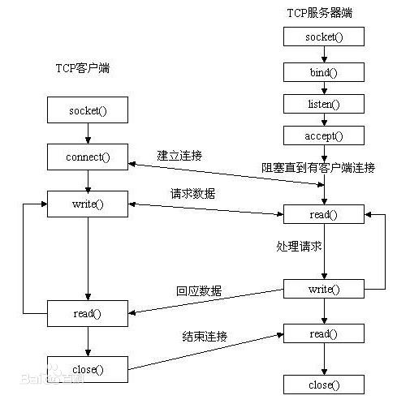


#### Socket 中的 read()、write() 函数

```cpp
ssize_t read(int fd, void *buf, size_t count);
ssize_t write(int fd, const void *buf, size_t count);
```

* read函数是负责从fd中读取内容.当读成功时，read返回实际所读的字节数。如果返回的值是0表示已经读到文件的结束了，小于0表示出现了错误。如果错误为EINTR说明读是由中断引起的，如果是ECONNREST表示网络连接出了问题。
* write函数将buf中的nbytes字节内容写入文件描述符fd。成功时返回写的字节数。失败时返回-1，并设置errno变量。在网络程序中，当我们向套接字文件描述符写时有俩种可能。（1）write的返回值大于0，表示写了部分或者是全部的数据。（2）返回的值小于0，此时出现了错误。我们要根据错误类型来处理。如果错误为EINTR表示在写的时候出现了中断错误。如果为EPIPE表示网络连接出现了问题（对方已经关闭了连接）。

#### socket中TCP的三次握手建立连接

我们知道tcp建立连接要进行“三次握手”，即交换三个分组。大致流程如下：

1. 客户端向服务器发送一个SYN J
2. 服务器向客户端响应一个SYN K，并对SYN J进行确认ACK J+1
3. 客户端再想服务器发一个确认ACK K+1

只有就完了三次握手，但是这个三次握手发生在socket的那几个函数中呢？请看下图：


从图中可以看出：
1. 当客户端调用connect时，触发了连接请求，向服务器发送了SYN J包，这时connect进入阻塞状态；  
2. 服务器监听到连接请求，即收到SYN J包，调用accept函数接收请求向客户端发送SYN K ，ACK J+1，这时accept进入阻塞状态；  
3. 客户端收到服务器的SYN K ，ACK J+1之后，这时connect返回，并对SYN K进行确认；  
4. 服务器收到ACK K+1时，accept返回，至此三次握手完毕，连接建立。

#### socket中TCP的四次握手释放连接

上面介绍了socket中TCP的三次握手建立过程，及其涉及的socket函数。现在我们介绍socket中的四次握手释放连接的过程，请看下图：


图示过程如下：

1. 某个应用进程首先调用close主动关闭连接，这时TCP发送一个FIN M；
2. 另一端接收到FIN M之后，执行被动关闭，对这个FIN进行确认。它的接收也作为文件结束符传递给应用进程，因为FIN的接收意味着应用进程在相应的连接上再也接收不到额外数据；
3. 一段时间之后，接收到文件结束符的应用进程调用close关闭它的socket。这导致它的TCP也发送一个FIN N；
4. 接收到这个FIN的源发送端TCP对它进行确认。

这样每个方向上都有一个FIN和ACK。

## 数据库

* 数据库事务四大特性：原子性、一致性、分离性、持久性
* 数据库索引：顺序索引 B+树索引 hash索引
[MySQL索引背后的数据结构及算法原理](http://blog.codinglabs.org/articles/theory-of-mysql-index.html)
* [SQL 约束 (Constraints)](http://www.w3school.com.cn/sql/sql_constraints.asp)


## 设计模式

## 链接装载库

### 内存、栈、堆

一般应用程序内存空间有如下区域：

* 栈：由操作系统自动分配释放，存放函数的参数值、局部变量等的值，用于维护函数调用的上下文
* 堆：一般由程序员分配释放，若程序员不释放，程序结束时可能由操作系统回收，用来容纳应用程序动态分配的内存区域
* 可执行文件映像：存储着可执行文件在内存中的映像，由装载器装载是将可执行文件的内存读取或映射到这里
* 保留区：保留区并不是一个单一的内存区域，而是对内存中受到保护而禁止访问的内存区域的总称，如通常C语言讲无效指针赋值为0（NULL），因此0地址正常情况下不可能有效的访问数据

#### 栈

栈保存了一个函数调用所需要的维护信息，常被称为堆栈帧（Stack Frame）或活动记录（Activate Record），一般包含以下几方面：

* 函数的返回地址和参数
* 临时变量：包括函数的非静态局部变量以及编译器自动生成的其他临时变量
* 保存上下文：包括函数调用前后需要保持不变的寄存器

#### 堆

堆分配算法：

* 空闲链表（Free List）
* 位图（Bitmap）
* 对象池

#### “段错误（segment fault）” 或 “非法操作，该内存地址不能read/write”

典型的非法指针解引用造成的错误。当指针指向一个不允许读写的内存地址，而程序却试图利用指针来读或写该地址时，会出现这个错误。

普遍原因：

* 将指针初始化位NULL，之后没有给它一个合理的值就开始使用指针
* 没用初始化栈中的指针，指针的值一般会是随机数，之后就直接开始使用指针

### 编译链接

#### 编译链接过程

1. 预编译（预编译器处理如`#include`、`#define`等预编译指令，生成`.i`或`.ii`文件）
2. 编译（编译器进行词法分析、语法分析、语义分析、中间代码生成、目标代码生成、优化，生成`.s`文件）
3. 汇编（汇编器把汇编码翻译成机器码，生成`.o`文件）
4. 链接（连接器进行地址和空间分配、符号决议、重定位，生成`.out`文件）

> 现在版本GCC把预编译和编译合成一步，预编译编译程序cc1、汇编器as、连接器ld

> MSVC编译环境，编译器cl、连接器link、可执行文件查看器dumpbin

#### 目标文件

编译器编译源代码后生成的文件叫做目标文件。目标文件从结构上讲，它是已经编译后的可执行文件格式，只是还没有经过链接的过程，其中可能有些符号或有些地址还没有被调整。

> 可执行文件（Windows的`.exe`和Linux的`ELF`）、动态链接库（Windows的`.dll`和Linux的`.so`）、静态链接库（Windows的`.lib`和Linux的`.a`）都是按照可执行文件格式存储（Windows按照PE-COFF，Linux按照ELF）

##### 目标文件格式

* Windows的PE（Portable Executable），或称为PE-COFF，`.obj`格式
* Linux的ELF（Executable Linkable Format），`.o`格式
* Intel/Microsoft的OMF（Object Module Format）
* Unix的`a.out`格式
* MS-DOS的`.COM`格式

> PE和ELF都是COFF（Common File Format）的变种

##### 目标文件存储结构

段 | 功能
--- | ---
File Header | 文件头，描述整个文件的文件属性（包括文件是否可执行、是静态链接或动态连接及入口地址、目标硬件、目标操作系统等）
.text section | 代码段，执行语句编译成的机器代码 
.data section | 数据段，已初始化的全局变量和局部静态变量
.bss section | BBS段（Block Started by Symbol），未初始化的全局变量和局部静态变量（因为默认值为0，所以只是在此预留位置，不占空间）
.rodate section | 只读数据段，存放只读数据，一般是程序里面的只读变量（如const修饰的变量）和字符串常量
.comment section | 注释信息段，存放编译器版本信息
.note.GNU-stack section | 堆栈提示段 

> 其他段略

#### 链接的接口————符号

在链接中，目标文件之间相互拼合实际上是目标文件之间对地址的引用，即对函数和变量的地址的引用。我们将函数和变量统称为符号（Symbol），函数名或变量名就是符号名（Symbol Name）。

如下符号表（Symbol Table）：

Symbol（符号名） | Symbol Value （地址）
--- | ---
main| 0x100
Add | 0x123
... | ...

### Linux的共享库（Shared Library）

Linux下的共享库就是普通的ELF共享对象。

共享库版本更新应该保证二进制接口ABI（Application Binary Interface）的兼容

#### 命名

`libname.so.x.y.z`

* x：主版本号，不同主版本号的库之间不兼容，需要重新编译
* y：次版本号，高版本号向后兼容低版本号
* z：发布版本号，不对接口进行更改，完全兼容

#### 路径

大部分包括Linux在内的开源系统遵循FHS（File Hierarchy Standard）的标准，这标准规定了系统文件如何存放，包括各个目录结构、组织和作用。

* `/lib`：存放系统最关键和最基础的共享库，如动态链接器、C语言运行库、数学库等
* `/usr/lib`：存放非系统运行时所需要的关键性的库，主要是开发库
* `/usr/local/lib`：存放跟操作系统本身并不十分相关的库，主要是一些第三方应用程序的库

> 动态链接器会在`/lib`、`/usr/lib`和由`/etc/ld.so.conf`配置文件指定的，目录中查找共享库

#### 环境变量

* `LD_LIBRARY_PATH`：临时改变某个应用程序的共享库查找路径，而不会影响其他应用程序
* `LD_PRELOAD`：指定预先装载的一些共享库甚至是目标文件
* `LD_DEBUG`：打开动态链接器的调试功能

### Windows的动态链接库（Dynamic-Link Library）

DLL头文件
```cpp
#ifdef __cplusplus
extern "C" {
#endif

#ifdef _WIN32
#  ifdef MODULE_API_EXPORTS
#    define MODULE_API __declspec(dllexport)
#  else
#    define MODULE_API __declspec(dllimport)
#  endif
#else
#  define MODULE_API
#endif

MODULE_API int module_init();

#ifdef __cplusplus
}
#endif
```

DLL源文件
```cpp
#define MODULE_API_EXPORTS
#include "module.h"

MODULE_API int module_init()
{
    /* do something useful */
    return 0;
}
```

### 运行库（Runtime Library）

#### 典型程序运行步骤

1. 操作系统创建进程，把控制权交给程序的入口（往往是运行库中的某个入口函数）
2. 入口函数对运行库和程序运行环境进行初始化（包括堆、I/O、线程、全局变量构造等等）。
3. 入口函数初始化后，调用main函数，正式开始执行程序主体部分。
4. main函数执行完毕后，返回到入口函数进行清理工作（包括全局变量析构、堆销毁、关闭I/O等），然后进行系统调用结束进程。

> 一个程序的I/O指代程序与外界的交互，包括文件、管程、网络、命令行、信号等。更广义地讲，I/O指代操作系统理解为“文件”的事物。

#### glibc 入口

`_start -> __libc_start_main -> exit -> _exit`

其中`main(argc, argv, __environ)`函数在`__libc_start_main`里执行。

#### MSVC CRT 入口

`int mainCRTStartup(void)`

执行如下操作：

1. 初始化和OS版本有关的全局变量。
2. 初始化堆。
3. 初始化I/O。
4. 获取命令行参数和环境变量。
5. 初始化C库的一些数据。
6. 调用main并记录返回值。
7. 检查错误并将main的返回值返回。

#### C语言运行库（CRT）

大致包含如下功能：

* 启动与退出：包括入口函数及入口函数所依赖的其他函数等。
* 标准函数：有C语言标准规定的C语言标准库所拥有的函数实现。
* I/O：I/O功能的封装和实现。
* 堆：堆的封装和实现。
* 语言实现：语言中一些特殊功能的实现。
* 调试：实现调试功能的代码。

#### C语言标准库（ANSI C）

包含：

* 标准输入输出（stdio.h）
* 文件操作（stdio.h）
* 字符操作（ctype.h）
* 字符串操作（string.h）
* 数学函数（math.h）
* 资源管理（stdlib.h）
* 格式转换（stdlib.h）
* 时间/日期（time.h）
* 断言（assert.h）
* 各种类型上的常数（limits.h & float.h）
* 变长参数（stdarg.h）
* 非局部跳转（setjmp.h）

## 海量数据处理

* [ 海量数据处理面试题集锦](http://blog.csdn.net/v_july_v/article/details/6685962)
* [十道海量数据处理面试题与十个方法大总结](http://blog.csdn.net/v_JULY_v/article/details/6279498)

## 音视频

* [最全实时音视频开发要用到的开源工程汇总](http://www.yunliaoim.com/im/1869.html)
* [18个实时音视频开发中会用到开源项目](http://webrtc.org.cn/18%E4%B8%AA%E5%AE%9E%E6%97%B6%E9%9F%B3%E8%A7%86%E9%A2%91%E5%BC%80%E5%8F%91%E4%B8%AD%E4%BC%9A%E7%94%A8%E5%88%B0%E5%BC%80%E6%BA%90%E9%A1%B9%E7%9B%AE/)

## 其他

## 书籍

* 《剑指Offer》
* 《编程珠玑》
* 《深度探索C++对象模型》
* 《Effective C++》
* 《More Effective C++》
* 《深入理解C++11》
* 《STL源码剖析》
* 《深入理解计算机系统》
* 《TCP/IP网络编程》
* 《程序员的自我修养》

## 复习刷题网站

* [leetcode](https://leetcode.com/)
* [牛客网](https://www.nowcoder.net/)
* [慕课网](https://www.imooc.com/)
* [菜鸟教程](http://www.runoob.com/)

## 招聘时间岗位

[牛客网 . 2018 IT名企校招指南](https://www.nowcoder.com/activity/campus2018)

## 面试题目经验

* [牛客网 . 2017秋季校园招聘笔经面经专题汇总](https://www.nowcoder.com/discuss/12805)
* [知乎 . 互联网求职路上，你见过哪些写得很好、很用心的面经？最好能分享自己的面经、心路历程。](https://www.zhihu.com/question/29693016)
* [知乎 . 互联网公司最常见的面试算法题有哪些？](https://www.zhihu.com/question/24964987)
* [知乎 . 面试 C++ 程序员，什么样的问题是好问题？](https://www.zhihu.com/question/20184857)
* [cnblogs . C++面试集锦( 面试被问到的问题 )](https://www.cnblogs.com/Y1Focus/p/6707121.html)
* [cnblogs . C/C++ 笔试、面试题目大汇总](https://www.cnblogs.com/fangyukuan/archive/2010/09/18/1829871.html)
* [cnblogs . 常见C++面试题及基本知识点总结（一）](https://www.cnblogs.com/LUO77/p/5771237.html)
* [CSDN . 全面整理的C++面试题](http://blog.csdn.net/ljzcome/article/details/574158)
* [CSDN . 百度研发类面试题（C++方向）](http://blog.csdn.net/Xiongchao99/article/details/74524807?locationNum=6&fps=1)
* [CSDN . c++常见面试题30道](http://blog.csdn.net/fakine/article/details/51321544)
* [CSDN . 腾讯2016实习生面试经验（已经拿到offer)](http://blog.csdn.net/onever_say_love/article/details/51223886)
* [segmentfault . C++常见面试问题总结](https://segmentfault.com/a/1190000003745529)