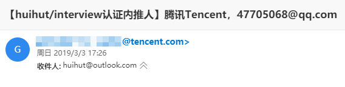
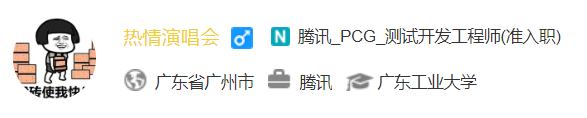
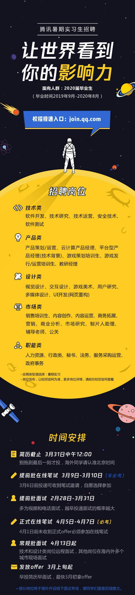

# 

## 内推方式
### 方式一 -> 适用于所有
- 面向2020届毕业的童鞋，本次内推的时间在2月28日-3月31日（现在内推可以免笔试）

- 如果有兴趣的发简历到邮箱47705068@qq.com（公司邮箱不公开，暴露了年龄了/doge）。如果看到有需求，会帮你把简历推到hr或者面试官手上。

- **正文内容需要标明，姓名、邮箱（建议最好是QQ邮箱）、手机号码、学校、专业**

- 内推的邮件**主题和简历文件命名**都应该如： `【Github内推】2020届-姓名-岗位`
- 查状态邮件**主题和简历文件命名**都应该如:  `【Github内推查询】姓名-查询内推状态`

### 方式二 -> 部门直推

> 另外我本人在PCG事业群，导师说我中心（对标社交产品）有需求，如果有意愿推**系统测试/测试开发/专项测试**的童鞋，可以按照上述说到的格式编写邮件，同样发到47705068@qq.com

- 内推的邮件**主题和简历文件命名**都应该如： `【Github直推】2020届-姓名-手机号码-学校-学历`

- **正文内容需要标明，姓名、邮箱（建议最好是QQ邮箱）、手机号码、学校、专业**

## 面向对象

- 2020年毕业的暑假实习生，2019届毕业的应届生

## 有效时间

- 长期有效

## 面试流程
### 我能查询到的状态有：

- 完整的流程是：待筛选->已锁定->初试中->复试中->GM面(可能存在有些部门会有此面)->HR面->待报批->报批中->已录用
- 失败即面试流程已放弃

### 你能在公众号或者官网查询到的状态有

- 初面中->复面中->GM面->HR面中->已完成所有面试
- 失败即不适合

## 相关链接

[【腾讯实习生内推】2020届暑假实习生，贴末有部门直推方式](https://www.nowcoder.com/discuss/157661)

## 内推认证
- 邮件认证

- [牛客验证](https://www.nowcoder.com/profile/5069984)

## 开放岗位

详情可以看 https://join.qq.com

