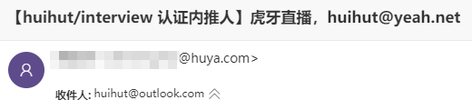

# 

## 内推方式

面向 2020 届实习、2020/2021 届校园大使、社招

【 **实习** 内推已于4月18日 **截止**，现在只能内推 **社招** 的朋友！！！】

发送简历到邮箱：<huihut@yeah.net>

邮件主题及简历文件名如：`【Github内推】2020届-姓名-岗位`（社招邮件里请写上[岗位链接](http://hr.huya.com/)）

## 开放岗位

请在 [校招](http://hr.huya.com/campus_apply/huya/4112) | [社招](http://hr.huya.com/) 官网查看并选好岗位，然后把 **岗位链接** 与 **简历** **按照格式** 发送至内推邮箱。

## 面试流程

* 面试方式：现场面试（广州、西安、武汉、合肥、北京、成都）、远程面试
* 面试流程：一般三面技术面，一面 HR 面

### 2020届实习

* 简历截止：4月18日 12:00（**现已截止**）
* 在线笔试：3月26日、4月23日
* 面试：3月30日前（第一批）、4月27日前（第二批）
* Offer 发放：3月-5月
* 入职实习：4-9月（实习时间不少于2个月）

## 注意事项

1. 请确保 **姓名、手机号、邮箱、最近毕业专业、毕业院校** 必须在简历或邮件正文有。
     

2. **90天内 已在官网投递的 或者 找其他虎牙同事内推的 或者 牛客网实习提前批投了的 无需再推**，内推和官网投递会冲突。  
     

3. 任何处理后的邮件都 **有回复**（内推成功或失败），一般 **晚上处理** 内推，请耐心等待。  
     

4. 如何 **查询内推状态**？  
    1. 在 **虎牙招聘** 公众号查询  
         
    2. 发送邮件到 <huihut@yeah.net> 查询，查询内推状态邮件主题如：`【Github内推查询】社招-姓名`。（此方式只能查询找我内推的朋友，无法查询别的虎牙同事内推的）

5. 2020 届 **实习时期** 是什么时候？**可以转正吗**？  
    **拿到Offer后就可以开始实习**，也 **可以暑期去实习**；**可以转正**，一般经过实习的同学 **更大几率拿秋季校招Offer**。

6. 2020 届 **牛客网实习提前批投了**，现在还可以内推吗？  
    提前批简历进入系统 **过后30天，即可再次内推，无论提前批是否淘汰**。

## 公司介绍

* 公司：[虎牙直播](http://www.huya.com/) （[了解虎牙](https://mp.weixin.qq.com/s?__biz=MzI3NTYzNjA3Ng==&mid=100000014&idx=1&sn=69a265ae6a19ff9cbf38cf4f9a8d5305&chksm=6b008b0d5c77021b571bfc9db5d2a9c23b3f605ef349bcdc9e3f6a79e8f11a0cf0878edd760c&mpshare=1&scene=1&srcid=#rd)、[虎牙简史](https://mp.weixin.qq.com/s?__biz=MzI3NTY4ODA2Ng==&mid=2247485411&idx=1&sn=d2132a4ace1eb63d5208ac4305337075&chksm=eb01b80edc763118ee9b502abf712c9aaa5d348ed06b043ea137453eac1edbca665d7c8b4a87&mpshare=1&scene=1&srcid=&key=98b8e515f0fc3f4540d0be9799126e654ddcfe69adb3d34ccc97a400792529c47a1ba388534f12e7d85854751a4eeff4b7a3c87aa1090620dd1c61928fe542da84a5e11eb5d1c39c255a0ce7d846623f&ascene=1&uin=NzYwMzE0OTM3&devicetype=Windows+10&version=62060728&lang=zh_CN&pass_ticket=8eTGEchivcN0VIZw8zrvcVaxDLD5oNoy46z3KtBZ0biDywQfp6rcY%2BPh%2BT9eXTHu)、[虎牙财报](https://mp.weixin.qq.com/s?__biz=MzI3NTYzNjA3Ng==&mid=2247484188&idx=1&sn=a1795c59d3265a7afa08afb462dc77ff&chksm=eb00891fdc770009f246ddf4f881def61eb68f3993d4a8cf6e5edb5ac5892ffe7ed83523bc34&mpshare=1&scene=1&srcid=&key=ecaf4cd30abcc970d81a7086626049aff0c8927b20d7bbadefc456f383571643aea85ea10fc84b2a798925b59917af79fbdd65bdf99dcbdcda4cd0100c41a35788dee56782059800f5b7fe6759ce33cb&ascene=1&uin=NzYwMzE0OTM3&devicetype=Windows+10&version=62060728&lang=zh_CN&pass_ticket=x6SaipzopZ17Gdbj0BRZ2J2NKljv7hxD%2FVcssg%2F65Hg2qWxDToyvTH%2FK5L8NN1dl)）

* 行业：直播 / 互联网

* 阶段：美股 IPO 上市

* 城市：主要在广州、珠海

* 作息：上午9:30-12:00，午休13:00-14:00，下午14:00-18:30，一周五天 | 晚上9点后下班第二天可以11点上班

* 福利：餐补、茶水夜宵、接驳巴士、旅游等

2012年，虎牙直播成立，并快速发展为中国领先的弹幕式直播互动平台，形成以游戏直播为主，涵盖娱乐、综艺、教育、户外、体育等多种直播内容综合性互动平台。

虎牙致力于为中国的年轻一代游戏爱好者创建一个参与、互动和沉浸式社区，截至2018年8月，虎牙直播的内容覆盖超过2600款游戏，汇聚众多世界冠军级战队和主播，拥有多项国内外赛事的直播版权，成为中国排名第一的游戏直播平台。

2017年5月，虎牙直播正式独立，成立广州虎牙信息科技有限公司，2018年3月，虎牙直播宣布获得腾讯战略投资4.62亿美元的B轮融资；5月，虎牙直播正式在纽约证券交易所挂牌交易，成为“游戏直播第一股”。

2018年5月3日，虎牙直播推出海外品牌NimoTV，上线后一举成为东南亚最大的游戏直播平台，并与腾讯游戏达成全面的战略合作，共同开拓海外游戏及游戏直播市场

## 相关链接

[【虎牙直播内推】2020届实习、社招 @huihut](https://www.nowcoder.com/discuss/157396)

## 内推人认证

